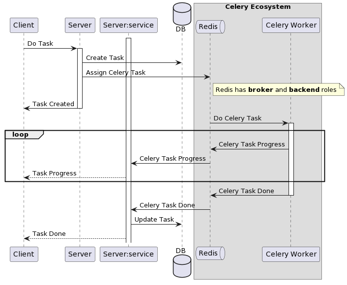

# FastAPI + PostgresSQL + Celery + Redis Example

An example demonstrates how to perform heavy and long-time background computation tasks(such as running a **machine learning model**) in **microservices**.

This repo was built up with two services: **API** service and **Worker** service.

**Service tech stack:**
- FastAPI (api server)
- Celery (worker)
- PostgresSQL (persist task in the database)
- Redis (message broker)

**API Service**
- REST API
  - create task
  - query task
- Message Queue
  - create task
  - query task
**Worker Service**
- Message Queue
  - run task
  - send task progress
  
Workflow:



_NOTE_:

- `Task` is defined by a custom FastAPI `App` frontend user.
- `Celery Task` is defined by `Celery` for internal
  - [task model](https://docs.celeryq.dev/en/latest/internals/reference/celery.backends.database.models.html#celery.backends.database.models.Task)
  - [result backend](https://docs.celeryq.dev/en/stable/userguide/tasks.html#result-backends)
- Update `Celery Task` progress with custom states
  - [celery task getting progress · GitHub](https://gist.github.com/siddhism/6399964b89ce734990763c922c3556da)
  - [python - How to retrieve meta from celery backend storage - Stack Overflow](https://stackoverflow.com/questions/34208399/how-to-retrieve-meta-from-celery-backend-storage)


## Get Started

```sh
docker run -it --rm fastapi-celery-web bash
```

```sh
docker exec -it fastapi-celery-db-1 bash
```

```sh
docker-compose build
# CTRL+C: just stop containers while keeping data
docker-compose up
docker-compose up -d

# Remove containers with wiping data
docker-compose down 
```

_NOTE_:

- `Dockerfile.dev` in `app` folder is used for development in a container environment. It builds a `virtual environment` with all dependencies installed to let you use such a `hot reload` feature when coding.
